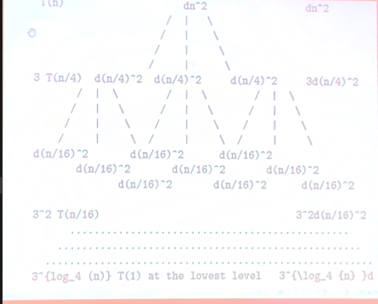

# Lecture 8 (2-3)

## Subtleties

We may need to select a tight asymptotic bound by subtracting a lower-order term, in order to complete the induction stpe of a proof.

Consider the recurrence for some constant $d > 0$:

$T(1) = d$
$T(n) = T(\lceil \frac{n}{2} \rceil) + T(\lfloor \frac{n}{2} \rfloor) + dn$ if $n > 1$.

We try to show by mathematical induction that $T(n) \leq cn$ for some constant $c > 0$.

Assume that the inequality holds for all $m > n$. Thus it holds at $\lceil \frac{n}{2} \rceil$ and $\lfloor \frac{n}{2} \rfloor$.

Using these inequalities, we have:

$T(n) = T(\lceil \frac{n}{2} \rceil) + T(\lfloor \frac{n}{2} \rfloor) + d \leq T(\lceil \frac{n}{2} \rceil) + T(\lfloor \frac{n}{2} \rfloor) + d = cn + d$.

We cannot obtain $T(n) \leq cn$.

We fix this problem by using a tighter upper bound on $T(n)$ as follows:

$T(n) \leq cn - e$ for some constant $c > 0$ and constant $e \geq 0$.

Now we have $T(n) \leq (c \lceil \frac{n}{2} \rceil - e) + (c \lfloor \frac{n}{2} \rfloor - e ) + d$ 

$= cn - e + d - e \leq cn - e $ if $d - e \leq 0$ or $e \geq d$.

Consider the base step.

We show that $(1)$ holds at $n = 1$. The left side $T(1) = d$.

The right side:

$c * 1 - e = x - e \geq c = T(1) e + d$.

Set $e$ to $d$ and $c$ to $2d$. Then we have for some constant $d > 0$.

$T(n) \leq 2dn - d \leq 2dn$ for all $n \geq 1$.

## Avoiding pitfalls

Consider $T(n)$ defined by the recurrence

$T(1) = 1$,

$T(n) = 2T(\lfloor \frac{n}{2} \rfloor) + n$ if $n > 1$.

What is wrong with the following proof that $T(n)$ is in $O(n)$?

We want to show that 

$T(n) \leq cn$ for some constant $c > 0$.

Assume that $T(\lfloor \frac{n}{2} \rfloor) \leq c \lfloor \frac{n}{2} \rfloor$.

Then we have $T(n) = 2T(\lfloor \frac{n}{2} \rfloor) + n \leq 2(\lfloor \frac{n}{2} \rfloor) + n \leq 2c(n/2) + n = cn + n = O(n)$.

The error is that we fail to conclude that $T(n) \leq cn + n \leq cn$.

## Solving reccurrences with the recursion-tree method

We draw a recursion tree to find a good guess for the recurrence.

Each node in a recursion tree is associated witht eh cost of a function invocation, with the cost of the non-recursive part shown at the node and with its children associated with the costs of the recursive function invocations.2c \lfloor \frac{n}{2} \rfloor + n \leq 2cn

We add the costs within each level of the tree to obtain a total of per-level costs.

Then we add all the per-level costs to obtain a total cost of all levels of the recursion.

Consider the recurrence for some constant $d > 0$

$T(n) = dn^2$ for $n > 4$,

$T(n) = 3T(\lfloor n/4 \rfloor)$ + dn^2$ for $n \geq 4$.

Assume that n is a power of 4.

 
We add up the costs over all levels to determine the total cost for the tree.

$T(n) = dn^2 + 3d(n/4)^2 + 3^2d(n/4^2)^2 + 3^3d(n/4^3)^2 + \dots + 3^{log_4 n-1} d (n/4^{log_4 n - 1})^2 + 3^{log_4n} T(n/4 ^ {log_4n})$

$\Sigma_{i=0}^{log_4{n-1}} (\frac{3}{16})^i dn^2 + n^{log_4 3}d \leq \Sigma_{i=0}^ \infty (\frac{3}{16})^i dn^2 + n^{\log _4 3 d}\\
= \frac{1}{1 - 3/16} dn^2 + dn^{\log _4 3}\\
= \frac{16}{13}dn^2 + dn^{log _4 3}\\
\leq \frac{16}{13}dn^2 + dn^2 = \frac{29}{13} dn^2 = cn^2$ for a constant $c > 0$.

## Proving by mathematical induction

We prove by mathematical induction that $T(n) \leq cn^2$ for some constant $c > 0$.

Where $T(n)$ is defined by the recurrence
$T(n) = dn^2$ for $n < 4,\\
 T(n) = 3T(\lfloor n/4 \rfloor) + dn^2$ for $n \geq 4$.

**Base**: For $1 \leq n < 4$, we have
$T(n) = dn^2 \leq cn^2$.

**Induction**: Assume that for every $m < n$, we have $T(m) \leq cm^2$. Setting $m = \lfloor n/4 \rfloor$, we obtain

$T(\lfloor n/4 \rfloor) \leq c(\lfloor n/4 \rfloor)^2$

Then we have $T(n) = 3T(\lfloor n/4 \rfloor) + dn^2 \leq 3c(\lfloor n/4 \rfloor)^2 +  dn^2 = \frac{3}{16}cn^2 + dn^2 \leq cn^2$. TBD

## Another example

Consider the recurrence for some constant $d > 0$

$T(n) = d(n-1)$ if $n < 3\\
 T(n) = T(\lfloor n/3 \rfloor) + T(\lfloor 2n/3 \rfloor) + dn$ if $n \geq 3$.

The value of this function at any $n$ can be obtained by using the recurrence. For example,

$T(3) = T(1) + T(2) + 3d = 0 + d + 3d = 4d$.

Assume that $n$ is a power of 3. Then $T(n) = T(n/3) + T(2n/3) + dn if $n \geq 3$.

Replacing n by n/3 and 2n/3 in the above recurrence, we obtain $T(n/3) = T(n/3^2) + T(2n/3^2) + d(n/3)$ and 
$T(2n/3) =  T(2n/3^2) + d(4n/3^2) + d(2n/3)$.
The sum of all costs at this level is $d(n/3) + d(2n/3) = dn$.

At the next level, we have
$T(n/3^2) = T(n/3^3) + T(4n/3^3) + d(2n/3^2)...$

The sum of all costs at this level is $d(n/3^2) + 2d(2n/3^2) + d(4n/3^2) = dn$.

The longest simple path from the root to a leaf is
$n \rightarrow (2/3) \rightarrow (2/3)^2n \dots \rightarrow 1$, 
where $(2/3)^kn =1$ or $(3/2)^k = n$.

Thus the height of the tree is $k = \log _{3/2} n$.

The sum of costs over all levels is the number of levels times the cost of each level, or $O(dn \log _{3/2} n) = O(n \log n)$

### Proving by mathematical induction

We prove by mathematical induction that $T(n) \leq cn \log n$ for some constant $c > 0$.

**Base**: For $1 \leq n < 3$, we have $T(n) = d(n-1) \leq cn \log n$ if $g \geq d$.

**Induction**: Assume that for every $1 \leq m < n$, we have
$T(M) \leq cm \log m$.
Setting $m = \lfloor n/3 \rfloor$ and $m=\lfloor 2n/3 \rfloor$, we obtain
$T(\lfloor n / 3 \rfloor) \leq c(\lfloor n/3 \rfloor) \log (\lfloor n/3 \rfloor)$ and

...TBD...

Then we have $T(n) = T(\lfloor n/3 \rfloor) + T(\lfloor 2n/3 \rfloor) + dn \leq c(\lfloor n/3 \rfloor) \log (\lfloor n/3 \rfloor) + c(\lfloor 2n/3 \rfloor) \log (\lfloor 2n/3 \rfloor) + dn \leq cn \log n$.
This equaltion was done through autopilot and wasn't in the lecture, so it might not be right.